# ACEest Fitness & Gym – DevOps CI/CD Pipeline

A Flask-based web application developed for **ACEest Fitness & Gym** as part of Assignment 2.  
This repository demonstrates a complete DevOps implementation covering application development, version control, automated testing, Jenkins CI/CD, SonarQube quality analysis, Docker containerization, Docker Hub image versioning, Kubernetes deployment using Minikube, advanced deployment strategies, and rollback validation.

---

## 1. Project Objective

The objective of this project is to build an end-to-end automated DevOps pipeline for the ACEest Fitness & Gym application. The pipeline ensures that every application version can be developed, tested, quality-checked, containerized, pushed to a registry, and deployed using Kubernetes in a repeatable manner.

This project demonstrates the following learning outcomes:

- Build an end-to-end automated DevOps pipeline.
- Integrate testing, quality assurance, and deployment automation.
- Apply real-world deployment and rollback strategies.
- Understand how DevOps improves software quality, delivery speed, consistency, and operational resilience.

---

## 2. Technology Stack

| Area                  | Tool / Technology                                       |
|-----------------------|---------------------------------------------------------|
| Application           | Python Flask                                            |
| UI                    | HTML, Jinja2 Templates, CSS                             |
| Database              | SQLite                                                  |
| Testing               | Pytest                                                  |
| Version Control       | Git and GitHub                                          |
| CI/CD                 | Jenkins                                                 |
| Static Code Analysis  | SonarQube                                               |
| Containerization      | Docker                                                  |
| Container Registry    | Docker Hub                                              |
| Orchestration         | Kubernetes                                              | 
| Local Cluster         | Minikube                                                |
| Public URL            | Render                                                  |
| Deployment Strategies | Rolling Update, Blue-Green, Canary, Shadow, A/B Testing |

---

## 3. Application Features

The ACEest Fitness & Gym application includes:

- Admin login
- Dashboard summary
- Add and view clients
- Membership tracking
- Fitness program generation
- Add and view workouts
- Health check endpoint
- Deployment strategy and version indicators on the UI

The application reads the following environment variables so that each deployed Kubernetes strategy can display release-specific information:

```bash
APP_VERSION
DEPLOYMENT_STRATEGY
DEPLOYMENT_COLOR
RELEASE_LABEL
```

---

## 4. DevOps Architecture

```text
Developer
   |
   v
GitHub Repository
   |
   v
Jenkins Pipeline
   |-- Checkout Code
   |-- Install Dependencies
   |-- Run Pytest
   |-- Run SonarQube Analysis
   |-- Build Docker Image
   |-- Run Tests inside Docker Container
   |-- Push Image to Docker Hub
   |
   v
Docker Hub Registry
   |
   v
Kubernetes / Minikube Deployment
   |-- Rolling Update
   |-- Blue-Green Deployment
   |-- Canary Release
   |-- Shadow Deployment
   |-- A/B Testing
   |-- Rollback Validation
```

---

## 5. Repository Structure

```text
aceest-fitness-gym-devops/
│
├── app.py
├── aceest_fitness.db
├── requirements.txt
├── Dockerfile
├── Jenkinsfile
├── sonar-project.properties
├── README.md
├── .dockerignore
├── .gitignore
│
├── templates/
│   ├── base.html
│   ├── login.html
│   ├── dashboard.html
│   ├── clients.html
│   ├── add_client.html
│   ├── membership.html
│   ├── workouts.html
│   └── add_workout.html
│
├── tests/
│   └── test_app.py
│
└── k8s/
    ├── base/
    │   ├── namespace.yaml
    │   ├── deployment.yaml
    │   └── service.yaml
    │
    ├── rolling-update/
    │   └── deployment.yaml
    │
    ├── blue-green/
    │   ├── deployment-blue.yaml
    │   ├── deployment-green.yaml
    │   ├── service-blue.yaml
    │   └── service-green.yaml
    │
    ├── canary/
    │   ├── deployment-stable.yaml
    │   ├── deployment-canary.yaml
    │   └── service.yaml
    │
    ├── shadow/
    │   ├── deployment-main.yaml
    │   ├── deployment-shadow.yaml
    │   ├── service-main.yaml
    │   └── service-shadow.yaml
    │
    └── ab-testing/
        ├── deployment-a.yaml
        ├── deployment-b.yaml
        ├── service-a.yaml
        └── service-b.yaml
```

---

## 6. Version Control Strategy

The project follows a structured Git workflow:

| Branch      | Purpose                                      |
|-------------|----------------------------------------------|
| `main`      | Stable production-ready code                 |
| `develop`   | Integration branch for tested changes        |
| `feature/*` | Individual feature or infrastructure changes |

Example feature branches:

- `feature/jenkins-pipeline`
- `feature/k8s-base`
- `feature/rolling-update`
- `feature/blue-green`
- `feature/canary`
- `feature/shadow`
- `feature/ab-testing`

Version tags are used to track incremental releases. Docker images are also tagged using version numbers such as:

```text
v1.0.0
v2.0.0
v3.0.0
latest
```

---

## 7. Local Application Setup

### 7.1 Clone Repository

```bash
git clone https://github.com/NandhiyaN/aceest-fitness-gym-devops.git
cd aceest-fitness-gym-devops
```

### 7.2 Install Dependencies

```bash
pip install -r requirements.txt
```

### 7.3 Run Application

```bash
python app.py
```

### 7.4 Open:

```text
http://localhost:5000
```

### 7.5 Default login:

```text
Username: admin@aceest.com
Password: Admin@123
```

---

## 8. Running Automated Tests

Run Pytest locally:

```bash
python -m pytest -v
```

The tests validate key application flows such as login, dashboard access, client management, workout management, and health checks.

---

## 9. SonarQube Code Quality Analysis

SonarQube is used for static code analysis and quality validation.

Run scanner locally after SonarQube is available:

```bash
sonar-scanner
```

The repository includes:

```text
sonar-project.properties
```

SonarQube is also integrated in the Jenkins pipeline using:

```groovy
withSonarQubeEnv('sonarqube-server') {
    sh """
    . .venv/bin/activate
    sonar-scanner
    """
}
```

**Screenshot added:**

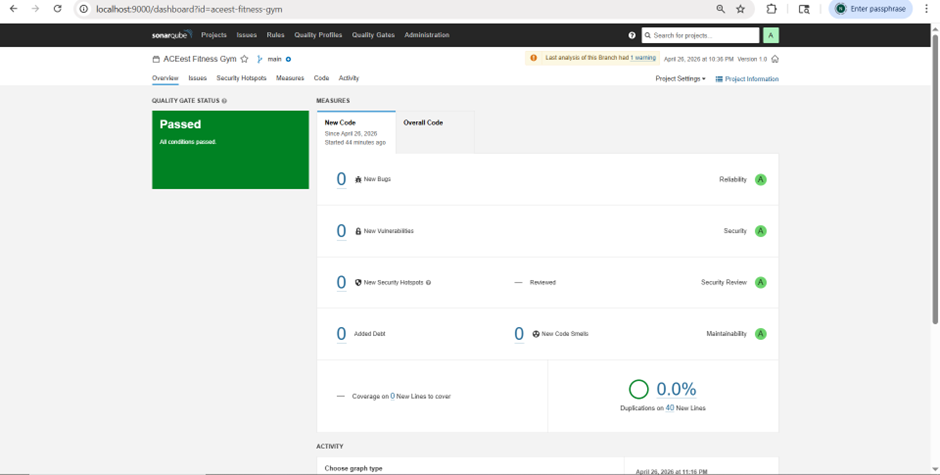

---

## 10. Docker Containerization

### 10.1 Build Docker Image

```bash
docker build -t nandhiyan/aceest-fitness-gym:v3.0.0 .
```

### 10.2 Run Docker Container

```bash
docker run -p 5000:5000 nandhiyan/aceest-fitness-gym:v3.0.0
```

Open:

```text
http://localhost:5000
```

### 10.3 Push Image to Docker Hub

```bash
docker tag nandhiyan/aceest-fitness-gym:v3.0.0 nandhiyan/aceest-fitness-gym:latest

docker push nandhiyan/aceest-fitness-gym:v3.0.0
docker push nandhiyan/aceest-fitness-gym:latest
```

Docker Hub repository:

```text
https://hub.docker.com/r/nandhiyan/aceest-fitness-gym
```

**Screenshot added:**

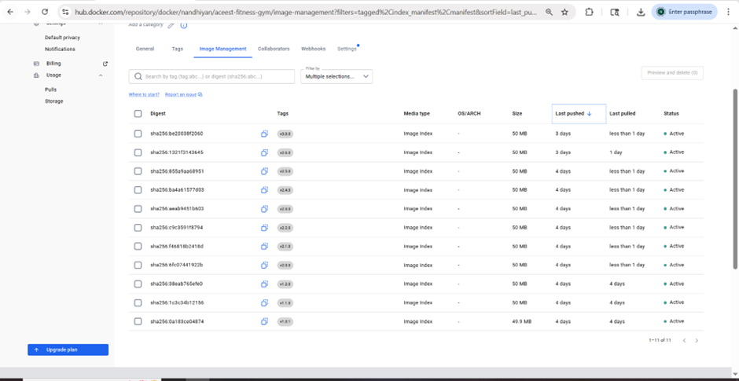
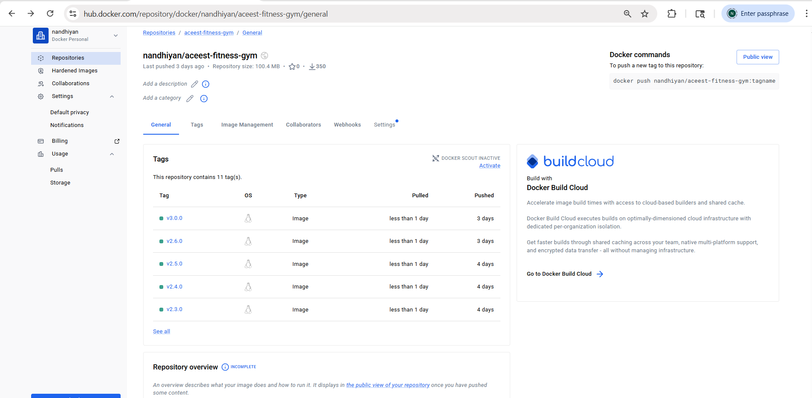

---

## 11. Jenkins CI/CD Pipeline

The Jenkinsfile implements the following pipeline stages:

1. Checkout
2. Install Dependencies
3. Run Tests
4. SonarQube Analysis
5. Build Docker Image
6. Run Tests Inside Docker Container
7. Push Docker Image

### Jenkins Image Configuration

```groovy
IMAGE_NAME = "nandhiyan/aceest-fitness-gym"
IMAGE_TAG = "v3.0.0"
DOCKER_CREDENTIALS_ID = "nandhiya-docker-hub-cred"
```

### Jenkins Pipeline Outcome

The pipeline ensures:

- Code is pulled from GitHub.
- Dependencies are installed in a clean environment.
- Pytest test cases are executed.
- SonarQube analysis is triggered.
- Docker image is built.
- Tests are executed inside the Docker image.
- Docker image is pushed to Docker Hub.

**Screenshot added:**


---

## 12. Kubernetes Deployment Using Minikube

### 12.1 Start Minikube

```bash
minikube start
```

### 12.2 Apply Base Kubernetes Manifests

```bash
kubectl apply -f k8s/base/
```

### 12.3 Verify Pods and Services

```bash
kubectl get pods -n aceest-devops
kubectl get svc -n aceest-devops
```

### 12.4 Access Application

```bash
minikube service aceest-fitness-service -n aceest-devops --url
```

Example output:

```text
http://127.0.0.1:<dynamic-port>
```

Note: When using Minikube with Docker driver on Windows, the terminal session may need to remain open for the local service URL to continue working.

**Screenshot added:**

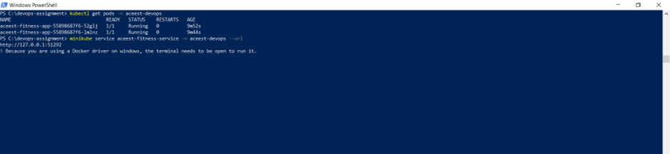
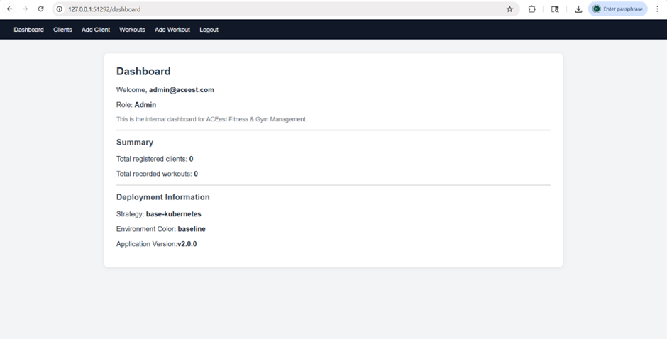

---

## 13. Deployment Strategies

### 13.1 Rolling Update

Rolling update gradually replaces old pods with new pods while maintaining availability.

Apply rolling update:

```bash
kubectl apply -f k8s/rolling-update/deployment.yaml
kubectl rollout status deployment/aceest-fitness-app -n aceest-devops
kubectl get pods -n aceest-devops
```

Rollback rolling update:

```bash
kubectl rollout history deployment/aceest-fitness-app -n aceest-devops
kubectl rollout undo deployment/aceest-fitness-app -n aceest-devops
kubectl rollout status deployment/aceest-fitness-app -n aceest-devops
```

**Screenshot added:**

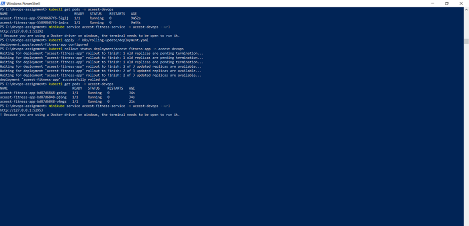
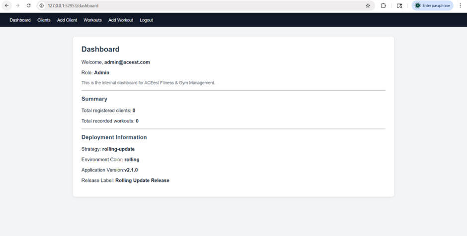
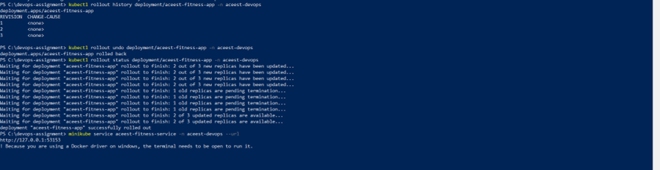
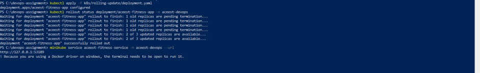

---

### 13.2 Blue-Green Deployment

Blue-Green deployment runs two releases in parallel:

- Blue = current stable version
- Green = new release version

Deploy Blue:

```bash
kubectl apply -f k8s/blue-green/deployment-blue.yaml
kubectl apply -f k8s/blue-green/service-blue.yaml
```

Deploy Green and switch service:

```bash
kubectl apply -f k8s/blue-green/deployment-green.yaml
kubectl apply -f k8s/blue-green/service-green.yaml
```

Access service:

```bash
minikube service aceest-blue-green-service -n aceest-devops --url
```

Rollback to Blue:

```bash
kubectl apply -f k8s/blue-green/service-blue.yaml
```

**Screenshot added:**

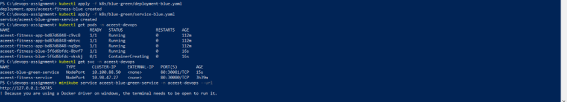
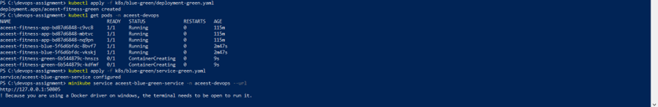

---

### 13.3 Canary Release

Canary release deploys a small number of new-version pods with stable pods. This reduces risk by exposing only a limited portion of traffic to the new version.

Deploy stable and canary:

```bash
kubectl apply -f k8s/canary/deployment-stable.yaml
kubectl apply -f k8s/canary/deployment-canary.yaml
kubectl apply -f k8s/canary/service.yaml
```

Verify:

```bash
kubectl get pods -n aceest-devops
kubectl get svc -n aceest-devops
minikube service aceest-canary-service -n aceest-devops --url
```

Rollback Canary:

```bash
kubectl delete deployment aceest-fitness-canary -n aceest-devops
```

**Screenshot added:**

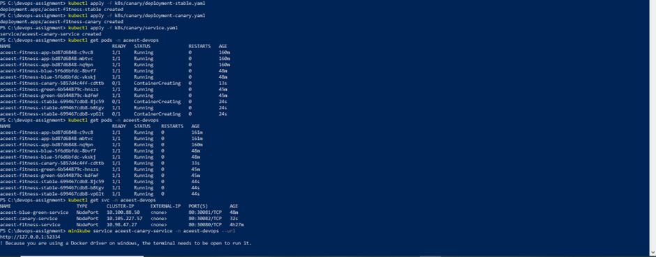
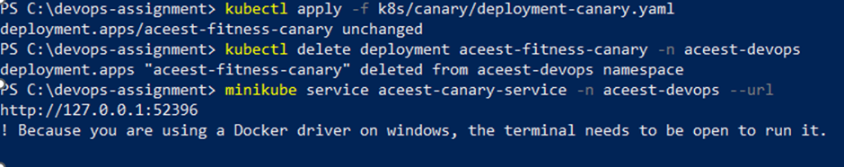

---

### 13.4 Shadow Deployment

Shadow deployment runs a copy of the application separately from the main release. This helps validate a new version without making it the primary user-facing version.

Deploy main and shadow:

```bash
kubectl apply -f k8s/shadow/deployment-main.yaml
kubectl apply -f k8s/shadow/deployment-shadow.yaml
kubectl apply -f k8s/shadow/service-main.yaml
kubectl apply -f k8s/shadow/service-shadow.yaml
```

Access URLs:

```bash
minikube service aceest-shadow-main-service -n aceest-devops --url
minikube service aceest-shadow-copy-service -n aceest-devops --url
```

**Screenshot added:**

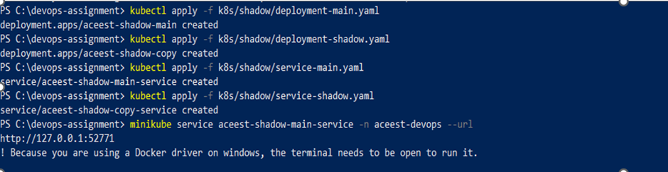
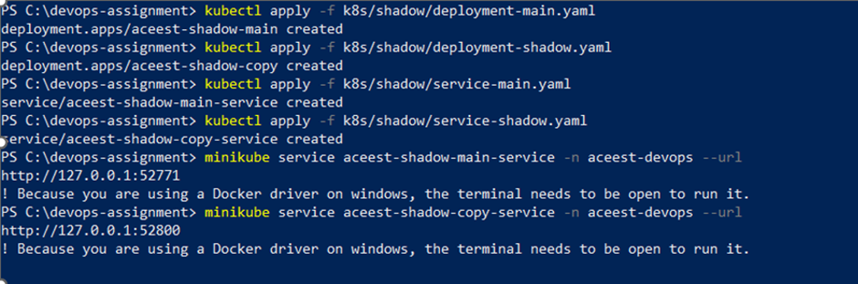

---

### 13.5 A/B Testing

A/B Testing deploys two variants of the application to compare behavior or user experience.

Deploy Variant A and Variant B:

```bash
kubectl apply -f k8s/ab-testing/deployment-a.yaml
kubectl apply -f k8s/ab-testing/deployment-b.yaml
kubectl apply -f k8s/ab-testing/service-a.yaml
kubectl apply -f k8s/ab-testing/service-b.yaml
```

Access both variants:

```bash
minikube service aceest-ab-a-service -n aceest-devops --url
minikube service aceest-ab-b-service -n aceest-devops --url
```

**Screenshot added:**


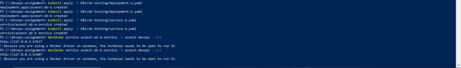

---

## 14. Rollback Summary

| Strategy | Rollback Method |
|---|---|
| Rolling Update | `kubectl rollout undo deployment/aceest-fitness-app -n aceest-devops` |
| Blue-Green | Reapply `service-blue.yaml` to switch traffic back to Blue |
| Canary | Delete canary deployment and continue using stable deployment |
| Shadow | Keep main release active and remove/ignore shadow copy |
| A/B Testing | Route users back to stable/approved variant |

---

## 15. Useful Kubernetes Commands

```bash
kubectl get pods -n aceest-devops
kubectl get svc -n aceest-devops
kubectl get deployments -n aceest-devops
kubectl rollout history deployment/aceest-fitness-app -n aceest-devops
kubectl rollout status deployment/aceest-fitness-app -n aceest-devops
kubectl describe pod <pod-name> -n aceest-devops
kubectl logs <pod-name> -n aceest-devops
```

---

## 16. Reference Links

GitHub Repository:

```text
https://github.com/NandhiyaN/aceest-fitness-gym-devops
```

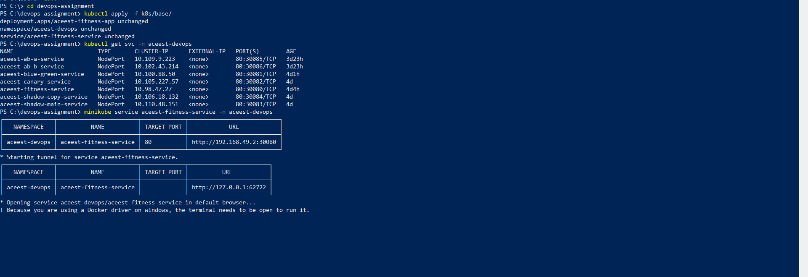


Docker Hub Repository:

```text
https://hub.docker.com/r/nandhiyan/aceest-fitness-gym
```

Docker Image:

```text
nandhiyan/aceest-fitness-gym:v3.0.0
```

Kubernetes Namespace:

```text
aceest-devops
```

Final Running Endpoint URLs:

```text
Final Deployment URL: https://aceest-fitness-gym-v3-0-0-final.onrender.com
Rolling Update URL: https://aceest-fitness-gym-v2-1-0-rollingupdate.onrender.com
Blue-Green URL: https://aceest-fitness-gym-v2-2-0-bluegreen.onrender.com
Canary URL: https://aceest-fitness-gym-v2-3-0-canary.onrender.com
Shadow URL: https://aceest-fitness-gym-v2-4-0.onrender.com
A/B URL: https://aceest-fitness-gym-v2-5-0-ab.onrender.com
```

---

## 17. Final Outcome

This project successfully implements a complete DevOps lifecycle for the ACEest Fitness & Gym application. It demonstrates automated build validation, test automation, static code analysis, Docker image creation, Docker Hub publishing, Kubernetes deployment, advanced deployment strategies, and rollback mechanisms.

The solution improves:

- Software quality
- Deployment speed
- Release consistency
- Operational resilience
- Traceability across versions
- Recovery capability during failed deployments
